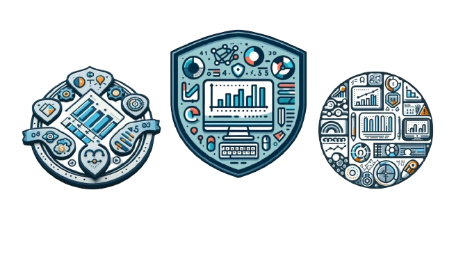

<h1 align="center">Projeto Ebook Gerado por IA 🤖</h1>

---

# Objetivo do Projeto

O projeto possui o objetivo de construir um ebook digital simples, utilizando Inteligencia Artificial (IA).

> ℹ️ **NOTE:** 

Este ebook foi elaborado com o auxílio de ferramentas de inteligência artificial (IA) como facilitadoras no processo de escrita e organização de informações. É importante ressaltar que a criação de conteúdo digital de qualidade exige domínio e conhecimento prévio do tema abordado. As ferramentas de IA, por mais avançadas que sejam, não substituem a expertise humana e a necessidade de pesquisa profunda sobre o assunto.

