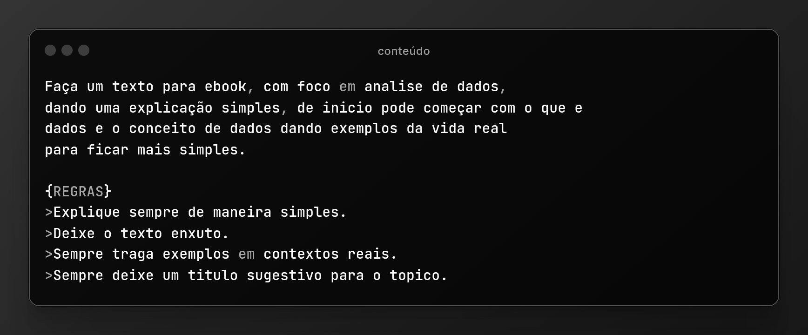
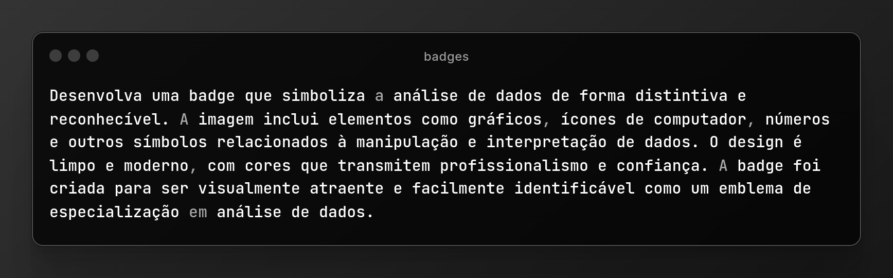
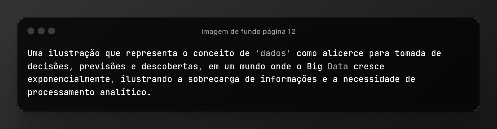

<h1 align="center">Projeto Ebook Gerado por IA 🤖</h1>

---

# Objetivo do Projeto

O projeto possui o objetivo de construir um ebook digital simples, utilizando Inteligencia Artificial (IA).

> ℹ️ **NOTE:** 

Este ebook foi elaborado com o auxílio de ferramentas de inteligência artificial (IA) como facilitadoras no processo de escrita e organização de informações. É importante ressaltar que a criação de conteúdo digital de qualidade exige domínio e conhecimento prévio do tema abordado. As ferramentas de IA, por mais avançadas que sejam, não substituem a expertise humana e a necessidade de pesquisa profunda sobre o assunto.

<a href="https://github.com/SergioSinhoca/criando-ebbok-Ia/blob/main/ebook/Ebook%20-%20CONHECENDO%20OS%20DADOS%20UM%20GUIA%20PARA%20INICIANTES.pdf"
 title="View PDF now"> 📖 Clique aqui para ler</a>
 
 
## 💻 Tecnologias utilizadas no projeto

- [Copilot](https://copilot.microsoft.com/) 
- [Canva](https://www.canva.com/)

## ✨ Prompts

### Conteúdo  
 
 

a cada conteúdo criado pela IA eu simplesmente utilizava **continue** para que a ferramente gerá-se o próximo capítulo. 

### Imagens das badges

 

 A Copilot gera 4 imagens.   

### Imagem de fundo página 12

 

## Imagens utilizadas 👇
As demais imagens não mencionadas contidas no ebook, é de exclusividade do Canva. 

- Imagens geradas pela IA `imagens-ia`
- Imagens utilizadas no Readme `assets`

